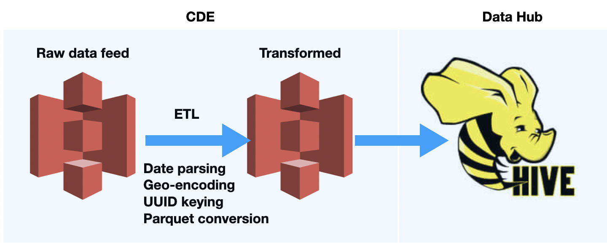
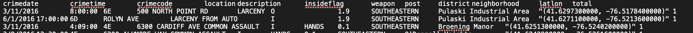
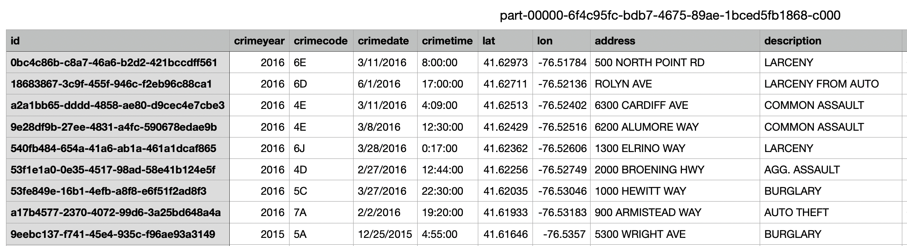

### ETL Pipeline
<br>

### Issue jobs at the command line on any client host, via a REST API, or easily within the CDE UI
```
./cde job create \
  --vcluster-endpoint=https://72s24ncc.cde-n44bzzmp.se-sandb.a465-9q4k.cloudera.site/dex/api/v1 \
  --type spark \
  --application-file AppETLCrimeData.py \
  --python-env-resource-name demo-resource-python \
  --name demo-job-python \
  --mount-1-resource demo-resource-py
```
### The jobs can be scheduled and orchestrated with Apache Airflow
```
/cde job update \
  --vcluster-endpoint=https://72s24ncc.cde-n44bzzmp.se-sandb.a465-9q4k.cloudera.site/dex/api/v1 \
  --name demo-job-python \
  --schedule-enabled=true \
  --schedule-start 2021-01-01T00:00:00Z \
  --every-days 1 \
  --for-minutes-of-hour 0 \
  --for-hours-of-day 0
```

### Raw data from city feed
<br>
### Transformation, Cleansing, Parquet formatting
<br>
### Data persisted in Hive on Datahub
<br>
