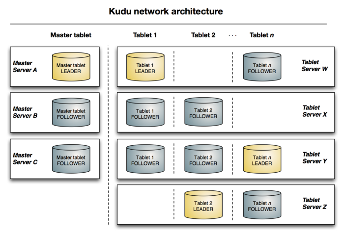

### Reasons to use Kudu <br>

<br>
<ul>
<li>Distributed, columnar storage engine outside of HDFS</li>
<li>Intuitive organization of data on disk</li>
<li>SQL Access Layer via Impala</li>
<li>Speed in random access reads and writes</li>
<li>Accommodation of upserts</li>
</ul>

This demo performs rollups of raw time series data and doesn't use predefined aggregations. <br>
Kudu is a better option than Druid for this need. <br>

### Possible deployment option

Keep recent time series data on Kudu possibly resting in NVMe devices. <br>
Offload older data to archival storage such as HDFS/Ozone or in the Cloud on S3 or ADLS. <br>

<br>

Tables use partitions spread across Tablets. Each Tablet has leader and follower nodes with replication <br>
to ensure resiliency. Storing data in a columnar fashion enables sequential layout, vectorization, and efficient compression. <br>

### DDLfor Kudu table <br>

```
CREATE TABLE bpd_crime_data 
( 
  id STRING NOT NULL, 
  crimeyear INT NOT NULL, 
  crimecode STRING,
  crimedate STRING,
  crimetime STRING,
  lat DOUBLE,
  lon DOUBLE,
  address STRING,
  description STRING,
  insideflag STRING,
  weapon STRING,
  post STRING,
  district STRING,
  neighborhood STRING,
  total STRING,
  PRIMARY KEY (id, crimeyear)
)
PARTITION BY HASH(id) PARTITIONS 10,
RANGE (crimeyear)
(
PARTITION 2010 < VALUES <= 2011,
PARTITION 2011 < VALUES <= 2012,
PARTITION 2012 < VALUES <= 2013,
PARTITION 2013 < VALUES <= 2014,
PARTITION 2014 < VALUES <= 2015,
PARTITION 2015 < VALUES <= 2016
)
STORED AS KUDU
TBLPROPERTIES (
'kudu.num_tablet_replicas' = '1'
)
;
```


