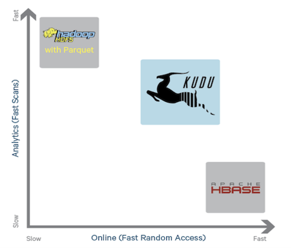

## Reasons to use Kudu  

  
<ul>
<li>Distributed, columnar storage engine outside of HDFS</li>
<li>Intuitive organization of data on disk</li>
<li>SQL Access Layer via Impala</li>
<li>Speed in both bulk and for random access reads and writes</li>
<li>Accommodation of upserts</li>
</ul>

